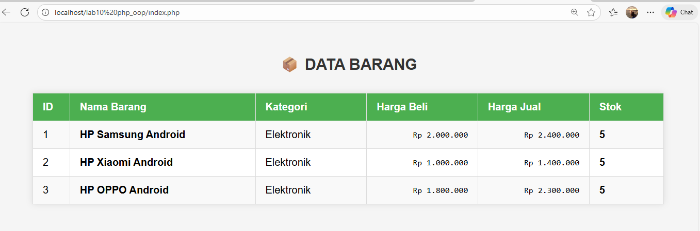
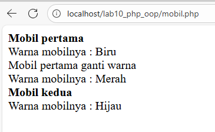

# LAB10 PHP OOP

Proyek ini adalah implementasi **PHP OOP** sederhana untuk mengelola data mobil dan form input. Proyek ini menggunakan konsep Object-Oriented Programming di PHP dan modularisasi file untuk database, form, dan konfigurasi.

## Fitur

1. **Form Input**  
   - Menambahkan data mobil melalui form OOP.
   - Validasi sederhana untuk input data.

2. **Database OOP**  
   - Koneksi database menggunakan class `Database`.
   - CRUD (Create, Read, Update, Delete) data mobil.

3. **Modularisasi**  
   - File terpisah untuk konfigurasi (`config.php`), database (`database.php`), dan form (`from.php`, `from input.php`).

## Cara Menjalankan

1. Pastikan **XAMPP/WAMP/LAMP** sudah terinstal dan Apache & MySQL berjalan.
2. Import database yang dibutuhkan (sesuai konfigurasi di `config.php`).
3. Letakkan folder `LAB10 PHP_OOP` di dalam `htdocs` (untuk XAMPP) atau root server.
4. Buka browser dan akses:

5. Gunakan form untuk menambahkan atau menampilkan data mobil.

## Catatan

- Pastikan nama file dan folder sesuai dengan struktur di atas.
- Sesuaikan konfigurasi database di `lib/config.php`.
- Semua class menggunakan namespace default, tidak menggunakan autoload.

## Screenshot

| Halaman | Preview |
|---------|--------|
| Form Input |

| Halaman Utama |  |
| Daftar Mobil |  |

